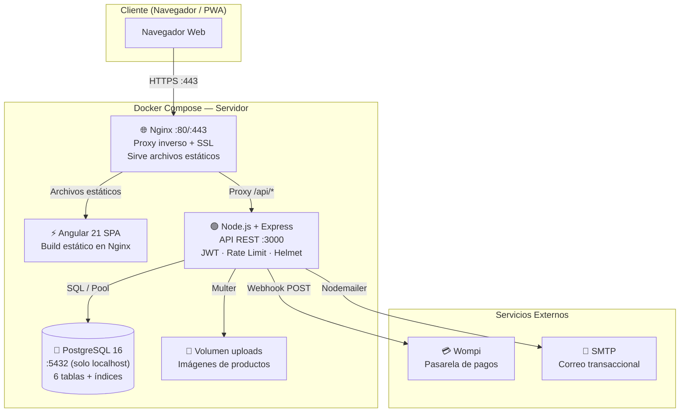
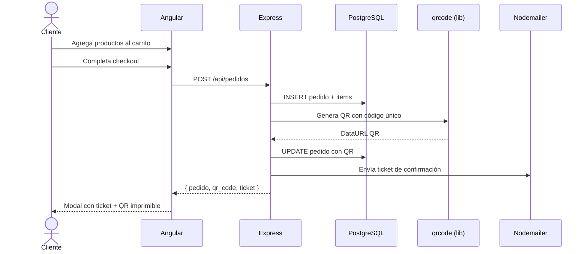

# La Flor de Azúcar — Repostería Online

> Aplicación web full-stack para pedidos en línea de repostería artesanal, con carrito de compras, pasarela de pagos Wompi, generación de tickets QR y verificación presencial en tienda.

---

## Tabla de Contenidos

1. [Descripción del Proyecto](#1-descripción-del-proyecto)
2. [Stack Tecnológico](#2-stack-tecnológico)
3. [Arquitectura del Sistema](#3-arquitectura-del-sistema)
4. [Funcionalidades](#4-funcionalidades)
5. [Estructura del Proyecto](#5-estructura-del-proyecto)
6. [Instalación y Ejecución Local](#6-instalación-y-ejecución-local)
7. [Variables de Entorno](#7-variables-de-entorno)
8. [Deploy en Servidor Universitario con Docker](#8-deploy-en-servidor-universitario-con-docker)
9. [API Endpoints](#9-api-endpoints)
10. [Capturas de Pantalla](#10-capturas-de-pantalla)
11. [Equipo](#11-equipo)

---

## 1. Descripción del Proyecto

### El problema que resuelve

Las reposterías artesanales pequeñas dependen casi exclusivamente de ventas presenciales o pedidos informales por WhatsApp, lo que genera:

- **Pérdida de ventas** por falta de disponibilidad fuera del horario de atención.
- **Errores en pedidos** al no tener un sistema formal de captura y seguimiento.
- **Dificultad para escalar** porque la gestión manual de inventario, pedidos y pagos consume tiempo del propietario.
- **Sin trazabilidad**: el cliente no sabe si su pedido fue recibido, está en preparación o listo.

### La solución

**La Flor de Azúcar** es una plataforma web que digitaliza el negocio completo:

- Catálogo de productos con imágenes, precios y filtros.
- Carrito de compras persistente (sin necesidad de cuenta).
- Proceso de checkout con confirmación por email y código QR único por pedido.
- Panel administrativo para gestionar productos, categorías, pedidos y usuarios.
- Verificación presencial mediante escaneo QR desde el móvil del administrador.
- Integración con Wompi (pasarela de pagos colombiana) para cobros en línea.
- Funciona como PWA: instalable en dispositivos móviles.

---

## 2. Stack Tecnológico

### Frontend

| Tecnología | Versión | Justificación |
|---|---|---|
| **Angular** | 21 | Framework SPA empresarial con Standalone Components y Signals para estado reactivo sin librerías externas. Tipado estático desde la base con TypeScript. |
| **TypeScript** | 5.9 | Tipado estático que reduce errores en tiempo de desarrollo y mejora la mantenibilidad. Angular lo requiere nativamente. |
| **Bootstrap** | 5.3 | Sistema de diseño responsivo maduro. Permite construir interfaces consistentes sin escribir CSS desde cero, con soporte cross-browser garantizado. |
| **SCSS** | — | Superset de CSS con variables, anidamiento y mixins. Permite mantener estilos organizados en componentes. |
| **RxJS** | 7.8 | Biblioteca reactiva estándar en Angular para manejo de flujos asíncronos (HTTP, eventos de usuario). |
| **jsQR** | 1.4 | Decodificador QR client-side que funciona directamente con el stream de la cámara, sin servicios externos. |

### Backend

| Tecnología | Versión | Justificación |
|---|---|---|
| **Node.js** | 20 LTS | Runtime JavaScript de alta concurrencia (event loop no bloqueante). Permite usar el mismo lenguaje en frontend y backend. |
| **Express** | 4.18 | Framework HTTP minimalista para Node.js. Sin opiniones rígidas, lo que facilita estructurar el proyecto según las necesidades del dominio. |
| **PostgreSQL** | 16 | Base de datos relacional con ACID completo. Ideal para datos transaccionales (pedidos, pagos) donde la integridad es crítica. Sin ORM para máximo control sobre las consultas. |
| **JWT + bcrypt** | — | Autenticación stateless: el servidor no almacena sesiones, escalando horizontalmente. bcrypt con 10 rondas resiste ataques de fuerza bruta. |
| **Helmet** | 8.2 | Configura cabeceras HTTP de seguridad (CSP, HSTS, X-Frame-Options) en un solo paquete. |
| **express-rate-limit** | 8.5 | Protección contra abusos y ataques DDoS a nivel de aplicación. |
| **Multer** | 2.1 | Middleware para carga de archivos multipart/form-data (imágenes de productos). |
| **Nodemailer** | 8.0 | Envío de emails transaccionales (confirmaciones, cambios de estado) vía SMTP. |
| **qrcode** | 1.5 | Generación server-side de códigos QR en formato DataURL/PNG por pedido. |
| **Wompi SDK** | — | Pasarela de pagos colombiana con sandbox incluido para desarrollo, sin costo de integración inicial. |

### Infraestructura

| Tecnología | Justificación |
|---|---|
| **Docker** | Garantiza que el entorno de desarrollo y producción sean idénticos. Elimina el problema de "funciona en mi máquina". |
| **Docker Compose** | Orquesta los 3 servicios (PostgreSQL, Backend, Frontend/Nginx) con un solo comando, definiendo dependencias y healthchecks. |
| **Nginx (Alpine)** | Servidor web de alto rendimiento para servir los archivos estáticos del build de Angular, actuar como proxy inverso hacia la API y terminar SSL. |
| **PostgreSQL Alpine** | Imagen Docker oficial con mínimo footprint de seguridad (sin herramientas innecesarias). |

---

## 3. Arquitectura del Sistema



### Flujo de un pedido



---

## 4. Funcionalidades

### Para clientes

- **Catálogo de productos**: grid con imágenes, precios, descuentos, filtros por categoría y búsqueda por nombre.
- **Detalle de producto**: modal con descripción, ingredientes, alérgenos y reseñas.
- **Carrito de compras**: sidebar deslizable, ajuste de cantidades, cálculo automático de subtotal + impuesto + descuento.
- **Carrito persistente**: se guarda en `localStorage`; no requiere cuenta.
- **Checkout completo**: datos de contacto, tipo de entrega (recoger / domicilio), dirección, método de pago, notas.
- **Ticket de pedido**: modal imprimible con resumen + código QR único por pedido.
- **Verificación pública**: URL `/verify/:codigo` muestra el estado del pedido sin requerir login.
- **Historial de pedidos**: para usuarios autenticados, vista de todos sus pedidos con estados.
- **Notificaciones por email**: confirmación al crear pedido y al cambiar de estado.
- **PWA**: instalable como app en dispositivos móviles y desktop.

### Para administradores

- **Panel admin** con 4 pestañas:
  - **Pedidos**: lista completa, filtros por estado, cambio de estado (pendiente → confirmado → preparando → listo → entregado / cancelado).
  - **Productos**: CRUD completo con imágenes, ingredientes, alérgenos, precio de descuento, stock.
  - **Categorías**: CRUD de categorías con imagen.
  - **Usuarios**: lista de usuarios, cambio de rol (cliente ↔ admin).
- **Escáner QR**: usa la cámara del dispositivo para escanear tickets QR en tienda y verificar pedidos al instante.
- **Subida de imágenes**: drag-and-drop con Multer.

### Técnicas / Seguridad

- Autenticación JWT con expiración de 7 días.
- Rate limiting: 200 req/15min global, 20/15min en rutas de auth, 10/hora en uploads.
- Cabeceras de seguridad HTTP con Helmet (CSP, HSTS, X-Frame-Options).
- Validación de inputs en servidor con `express-validator`.
- Contraseñas hasheadas con bcrypt (10 rondas).
- Contenedores Docker con usuario no-root.
- Health checks en todos los servicios.
- Graceful shutdown al recibir SIGTERM.
- Base de datos solo accesible desde `localhost` (no expuesta públicamente).

---

## 5. Estructura del Proyecto

```
bakery-app/
├── docker-compose.yml          # Orquestación: PostgreSQL + Backend + Frontend
├── deploy.ps1                  # Script de deploy automático (PowerShell)
├── start.bat                   # Script dev local para Windows
│
├── backend/                    # API REST — Node.js / Express
│   ├── Dockerfile              # Build multi-stage
│   ├── .env.example            # Plantilla de variables de entorno
│   └── src/
│       ├── index.js            # Entry point + configuración Express
│       ├── config/
│       │   └── database.js     # Pool de conexiones PostgreSQL
│       ├── controllers/
│       │   ├── authController.js
│       │   ├── orderController.js
│       │   ├── productController.js
│       │   └── uploadController.js
│       ├── middleware/
│       │   ├── auth.js         # Middleware JWT + verificación de rol admin
│       │   └── validators.js   # Reglas de validación (express-validator)
│       ├── migrations/
│       │   ├── schema.sql      # Esquema inicial: 6 tablas + índices + seed
│       │   ├── migrate-002.sql # Migración: columna referencia_pago
│       │   └── run.js          # Runner de migraciones
│       ├── routes/
│       │   └── index.js        # Centralizador de rutas
│       └── services/
│           ├── emailService.js # Nodemailer (confirmaciones)
│           ├── pagoService.js  # Orquestador de pagos
│           └── providers/
│               ├── PaymentProvider.js    # Interfaz base
│               ├── PaymentFactory.js     # Selector de proveedor
│               ├── WompiProvider.js      # Integración Wompi
│               ├── StripeProvider.js     # Integración Stripe (stub)
│               └── MercadoPagoProvider.js # Integración MP (stub)
│
└── bakery-frontend/            # SPA Angular 21
    ├── Dockerfile              # Multi-stage: ng build → nginx
    ├── nginx.conf              # Proxy inverso + SSL + compresión
    ├── proxy.conf.json         # Proxy de desarrollo (→ localhost:3000)
    └── src/app/
        ├── models.ts           # Interfaces: Product, CartItem, Order, User
        ├── services/
        │   ├── api.ts          # HTTP wrapper con interceptor JWT
        │   ├── auth.ts         # Estado de autenticación (Signals)
        │   ├── cart.ts         # Carrito (Signals + localStorage)
        │   └── product.ts      # Productos (Signals + paginación)
        └── components/
            ├── navbar/         ├── hero/
            ├── product-grid/   ├── product-detail/
            ├── cart-sidebar/   ├── checkout-modal/
            ├── ticket-modal/   ├── auth-modal/
            ├── admin/          ├── qr-scanner/
            ├── verifier/       ├── toast/
            └── footer/
```

---

## 6. Instalación y Ejecución Local

### Prerrequisitos

| Herramienta | Versión mínima |
|---|---|
| Node.js | 20 LTS |
| npm | 10+ (incluido con Node 20) |
| PostgreSQL | 16 (o usar Docker) |
| Angular CLI | `npm install -g @angular/cli` |

### Backend

```bash
cd backend
npm install
cp .env.example .env
# Editar .env con los datos de tu PostgreSQL local
npm run migrate      # Crea tablas y datos de ejemplo
npm run dev          # Servidor con nodemon en http://localhost:3000
```

### Frontend

```bash
cd bakery-frontend
npm install
ng serve             # http://localhost:4200
```

> El archivo `proxy.conf.json` redirige `/api/*` automáticamente a `http://localhost:3000`, por lo que no es necesario configurar CORS manualmente en desarrollo.

### Alternativa: Todo con Docker (recomendado)

```bash
# En la raíz del proyecto (bakery-app/)
cp backend/.env.example backend/.env
# Editar .env con DB_PASSWORD y JWT_SECRET seguros

docker compose up --build
# Frontend: http://localhost
# API:      http://localhost:3000
# Health:   http://localhost/health
```

---

## 7. Variables de Entorno

Copiar `backend/.env.example` a `backend/.env` y completar los valores:

### Obligatorias

| Variable | Descripción | Ejemplo |
|---|---|---|
| `DB_PASSWORD` | Contraseña de PostgreSQL | `MiPassword2024!` |
| `JWT_SECRET` | Clave para firmar tokens JWT (mínimo 32 caracteres) | *(generada con crypto)* |
| `DOMAIN` | Dominio del sitio (solo en producción) | `laflordeazucar.com` |

Generar `JWT_SECRET` seguro:
```bash
node -e "console.log(require('crypto').randomBytes(32).toString('hex'))"
```

### Opcionales

| Variable | Descripción | Default |
|---|---|---|
| `DB_HOST` | Host de PostgreSQL | `localhost` |
| `DB_PORT` | Puerto PostgreSQL | `5432` |
| `DB_NAME` | Nombre de la base de datos | `reposteria` |
| `DB_USER` | Usuario de PostgreSQL | `postgres` |
| `PORT` | Puerto del servidor Express | `3000` |
| `NODE_ENV` | Entorno (`development` / `production`) | `development` |
| `SMTP_HOST` | Servidor SMTP para emails | — |
| `SMTP_PORT` | Puerto SMTP | `587` |
| `SMTP_USER` | Usuario SMTP | — |
| `SMTP_PASS` | Contraseña SMTP | — |
| `PAYMENT_PROVIDER` | Proveedor de pago (`wompi` / `stripe` / `mercadopago`) | `wompi` |
| `WOMPI_API_URL` | URL API Wompi | `https://sandbox.wompi.co/v1` |
| `WOMPI_PUBLIC_KEY` | Llave pública Wompi | — |
| `WOMPI_PRIVATE_KEY` | Llave privada Wompi | — |

> Para pruebas de email sin SMTP real, usar [Ethereal Email](https://ethereal.email) (genera credenciales temporales gratuitas).

---

## 8. Deploy en Servidor Universitario con Docker

> **Supuesto:** El servidor Linux ya tiene Docker y Docker Compose v2 instalados. Se accede por SSH. No se requiere dominio — se puede usar la IP del servidor.

### Paso 1 — Clonar el repositorio

```bash
ssh usuario@IP_DEL_SERVIDOR
git clone https://github.com/TU_USUARIO/TU_REPO.git
cd TU_REPO
```

### Paso 2 — Crear el archivo de variables de entorno

```bash
cp backend/.env.example backend/.env
nano backend/.env
```

Valores mínimos a configurar:

```env
DB_PASSWORD=UnaContraseñaSegura2024
JWT_SECRET=genera_con_node_crypto_como_se_indica_arriba
DB_HOST=localhost
PORT=3000
NODE_ENV=production
FRONTEND_URL=http://IP_DEL_SERVIDOR
API_URL=http://localhost:3000
```

### Paso 3 — Certificados SSL

**Opción A — Sin SSL (HTTP simple, para pruebas internas)**

Editar `bakery-frontend/nginx.conf` y comentar el bloque `server` de HTTPS, dejando solo el de HTTP en el puerto 80. Luego en `docker-compose.yml` quitar el mapeo del puerto `443:443`.

**Opción B — SSL autofirmado (HTTPS con advertencia del navegador)**

```bash
mkdir certs
docker run --rm -v "$(pwd)/certs:/certs" alpine sh -c \
  'apk add openssl && openssl req -x509 -nodes -days 365 -newkey rsa:2048 \
   -keyout /certs/privkey.pem -out /certs/fullchain.pem \
   -subj "/CN=IP_DEL_SERVIDOR"'
```

### Paso 4 — Construir e iniciar los servicios

```bash
docker compose up -d --build
```

Este comando:
1. Construye las imágenes de backend y frontend.
2. Descarga la imagen de PostgreSQL 16.
3. Ejecuta las migraciones SQL automáticamente al iniciar.
4. Inserta datos de demo (5 categorías, 8 productos, usuario admin).
5. Levanta los 3 contenedores en orden correcto (salud verificada).

### Paso 5 — Verificar el despliegue

```bash
# Estado de los contenedores
docker compose ps

# Logs del backend
docker compose logs backend

# Health check de la API
curl http://localhost:3000/health

# Health check desde fuera (si HTTP)
curl http://IP_DEL_SERVIDOR/health
```

### Credenciales de demo

| Rol | Email | Contraseña |
|---|---|---|
| Admin | `admin@bakery.com` | `Admin123` |

> **Cambiar inmediatamente** la contraseña del admin en producción desde el panel administrativo.

### Comandos útiles de mantenimiento

```bash
# Ver logs en tiempo real
docker compose logs -f

# Reiniciar un servicio
docker compose restart backend

# Detener todo
docker compose down

# Detener y eliminar datos (¡borra la base de datos!)
docker compose down -v

# Actualizar tras un git pull
git pull
docker compose up -d --build
```

---

## 9. API Endpoints

**Base URL:** `http://localhost:3000`

### Salud
| Método | Ruta | Auth | Descripción |
|---|---|---|---|
| GET | `/health` | No | Health check con uptime |

### Autenticación
| Método | Ruta | Auth | Descripción |
|---|---|---|---|
| POST | `/api/auth/register` | No | Registro de usuario |
| POST | `/api/auth/login` | No | Login → retorna JWT |
| GET | `/api/auth/profile` | JWT | Perfil del usuario |
| GET | `/api/usuarios` | Admin | Listar todos los usuarios |
| PATCH | `/api/usuarios/:id/rol` | Admin | Cambiar rol del usuario |

### Productos
| Método | Ruta | Auth | Descripción |
|---|---|---|---|
| GET | `/api/productos` | No | Listar (filtros: categoria, destacado, buscar, page, limit) |
| GET | `/api/productos/categorias` | No | Listar categorías activas |
| GET | `/api/productos/:id` | No | Detalle de un producto |
| POST | `/api/productos` | Admin | Crear producto |
| PUT | `/api/productos/:id` | Admin | Actualizar producto |
| DELETE | `/api/productos/:id` | Admin | Eliminar producto |
| POST | `/api/categorias` | Admin | Crear categoría |
| PUT | `/api/categorias/:id` | Admin | Actualizar categoría |
| DELETE | `/api/categorias/:id` | Admin | Eliminar categoría |

### Pedidos
| Método | Ruta | Auth | Descripción |
|---|---|---|---|
| POST | `/api/pedidos` | No | Crear pedido (genera QR + email) |
| GET | `/api/pedidos/mis-pedidos` | JWT | Pedidos del usuario autenticado |
| GET | `/api/pedidos/verificar/:codigo` | No | Verificar pedido por código |
| GET | `/api/pedidos` | Admin | Listar todos los pedidos |
| PATCH | `/api/pedidos/:id/estado` | Admin | Cambiar estado del pedido |

### Pagos y Archivos
| Método | Ruta | Auth | Descripción |
|---|---|---|---|
| POST | `/api/pagos/wompi-confirm` | No | Webhook de confirmación Wompi |
| POST | `/api/upload` | Admin | Subir imagen de producto |

---

## 10. Capturas de Pantalla

> A continuación se sugieren las capturas que mejor ilustran el proyecto para la presentación:

| # | Vista | Descripción |
|---|---|---|
| 1 | **Página principal** | Hero section + navbar con contador de carrito |
| 2 | **Catálogo con filtros** | Grid de productos, filtro por categoría activo |
| 3 | **Detalle de producto** | Modal con imagen, ingredientes, alérgenos |
| 4 | **Carrito de compras** | Sidebar abierto con items y total calculado |
| 5 | **Checkout** | Formulario completo con tipo de entrega seleccionado |
| 6 | **Ticket + QR** | Modal de confirmación con código QR imprimible |
| 7 | **Panel admin — Pedidos** | Lista de pedidos con cambio de estado |
| 8 | **Panel admin — Escáner QR** | Cámara activa escaneando un ticket |
| 9 | **Vista móvil** | Cualquiera de las anteriores en resolución 390px |
| 10 | **docker compose ps** | Terminal mostrando los 3 contenedores `Up (healthy)` |

---

## 11. Equipo

| Nombre | Rol | 
|---|---|
| Jefferson Manuel Valencia Riascos | Desarrollo Full-Stack | 
| Yensy Daniel Montaño Sánchez | Desarrollo Full-Stack | 
| Jose Manuel Salas Valencia | Desarrollo Full-Stack | 

**Institución:** Universidad del Pacifico  
**Programa:** Ingenieria En Sistemas 
**Materia:** Seminario I
**Docente:** Gonzalo Andres Lucio Lopez 
**Período:** 2026-I

---

## Seguridad implementada

| Mecanismo | Detalle |
|---|---|
| **Helmet** | Cabeceras HTTP seguras (CSP, HSTS, X-Content-Type-Options) |
| **Rate Limiting** | 200 req/15min global · 20/15min auth · 10/hora uploads |
| **CORS** | Restringido al origen del frontend en producción |
| **bcrypt** | 10 rondas de hashing para contraseñas |
| **JWT** | Tokens con expiración de 7 días |
| **express-validator** | Validación de todos los inputs de mutación |
| **Non-root containers** | Todos los contenedores Docker ejecutan como usuario sin privilegios |
| **Graceful Shutdown** | SIGTERM/SIGINT cierran el pool de BD correctamente |
| **DB isolation** | PostgreSQL solo accesible desde la red interna de Docker |
| **Nginx** | TLSv1.2/1.3, HSTS, gzip, headers de seguridad |
